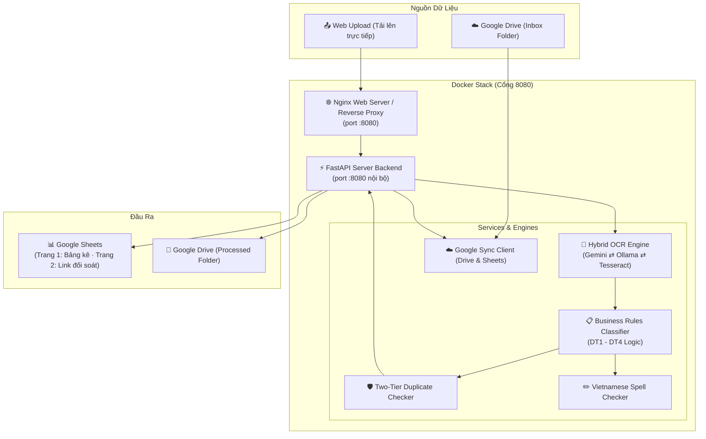
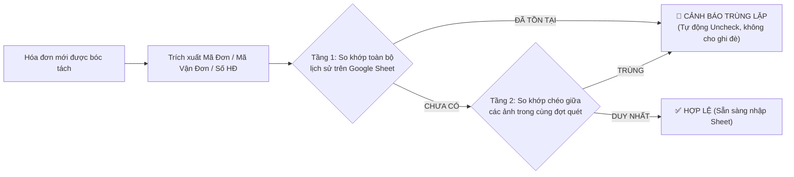

# 🧾 Procurement Receipt OCR & Automation Hub (v2.0)

<p align="center">
  
  
  
  
  
  
  
</p>

<p align="center">
  <strong>Hệ thống tự động hóa trích xuất hóa đơn mua hàng thông minh (Zero-Touch Procurement)</strong><br>
  Tự động thu thập ảnh từ Google Drive ➔ Trích xuất OCR Hybrid ➔ Phân loại 4 nhóm doanh nghiệp ➔ Kiểm soát trùng lặp 2 tầng ➔ Xuất bảng tính Google Sheets chuẩn hóa.
</p>

---

## 📑 Mục Lục
- [🌟 Tính Năng Nổi Bật](#-tính-năng-nổi-bật)
- [🏗️ Kiến Trúc Hệ Thống](#️-kiến-trúc-hệ-thống)
- [🏷️ Phân Loại 4 Nhóm Đối Tượng Doanh Nghiệp](#️-phân-loại-4-nhóm-đối-tượng-doanh-nghiệp)
- [🛡️ Cơ Chế Chống Trùng Lặp 2 Tầng (Duplicate Guard)](#️-cơ-chế-chống-trùng-lặp-2-tầng-duplicate-guard)
- [📋 Cấu Trúc Bảng Dữ Liệu Chuẩn](#-cấu-trúc-bảng-dữ-liệu-chuẩn)
- [🚀 Hướng Dẫn Cài Đặt & Khởi Chạy](#-hướng-dẫn-cài-đặt--khởi-chạy)
- [⚙️ Cấu Hình Môi Trường (.env)](#️-cấu-hình-môi-trường-env)
- [🖥️ Giao Diện Web Dashboard](#️-giao-diện-web-dashboard)
- [🧪 Kiểm Thử (Unit Tests)](#-kiểm-thử-unit-tests)
- [🤝 Đóng Góp & Giấy Phép](#-đóng-góp--giấy-phép)

---

## 🌟 Tính Năng Nổi Bật

* **🤖 Kiến Trúc Hybrid OCR Đa Tầng:**
  * **Online (Ưu tiên):** Sử dụng Google Gemini (`gemini-3.1-flash-lite`, `gemini-2.5-flash-lite`, `gemini-3.5-flash-lite`) với tốc độ bóc tách 2–4s/hóa đơn, chuẩn xác 100% tiếng Việt có dấu.
  * **Offline (Tự động chuyển đổi):** Khi mất kết nối mạng hoặc lỗi quota, hệ thống tự động fallback sang mô hình cục bộ **Ollama (`qwen2.5-vl:7b`)** chạy bằng GPU nội bộ.
  * **Dự phòng:** Tích hợp Tesseract OCR tiếng Việt (`vie`).
* **⚡ Quy Trình Zero-Touch Đồng Bộ Hai Chiều:**
  * Tự động quét và nạp ảnh từ thư mục Google Drive (Inbox).
  * Tự động di chuyển ảnh sang thư mục Đã xử lý (Processed) để dọn sạch hộp thư đến.
  * Xuất trực tiếp dữ liệu chuẩn hóa và liên kết ảnh đối chiếu lên Google Sheets.
* **🏷️ Tự Động Phân Loại 4 Nhóm Doanh Nghiệp:** Cấp mã tăng liên tục `DTnXXXX` (`DT10001`, `DT20001`...) theo quy tắc kế toán chuẩn.
* **🛡️ Duplicate Guard 2 Tầng:** Đối soát tự động dựa trên 4 khóa định danh (`Order ID`, `Tracking Number`, `Invoice Number`, `Receipt ID`) để ngăn chặn nhân đôi chi phí.
* **🔍 Kiểm Soát Thuế VAT & Kiểm Tra Chính Tả:**
  * Tự động tính toán đơn giá trước thuế, tiền VAT, tổng tiền và gắn cờ cảnh báo nếu có VAT.
  * Tự động phát hiện lỗi gõ Telex, phụ âm cuối lặp, lỗi font OCR tiếng Việt.
* **🖥️ Giao Diện Web Dashboard Hiện Đại:** Chạy trên Nginx Reverse Proxy (Cổng `8080`) với phong cách Glassmorphism, hỗ trợ duyệt từng chứng từ (Human-in-the-loop) trước khi đưa vào bảng tính.

---

## 🏗️ Kiến Trúc Hệ Thống



---

## 🏷️ Phân Loại 4 Nhóm Đối Tượng Doanh Nghiệp

| Nhóm | Tên Đối Tượng | Tiêu Chí Nhận Diện | Quy Tắc Trình Bày Riêng |
| :---: | :--- | :--- | :--- |
| **DT1** | **Sàn TMĐT & Dịch Vụ Vận Chuyển** | Shopee, SPX, Lazada, TikTok Shop, Tiki, Grab, GHTK, GHN... | **Tổng hợp trên 1 dòng duy nhất**: Cột F để trống, tổng SL tại Cột G, toàn bộ danh sách mặt hàng và mã vận đơn ghi chú chi tiết vào Cột J/N. |
| **DT2** | **Siêu Thị & Bán Lẻ Chung Quy** | Co.opmart, WinMart, Big C, Go!, Lotte, Circle K, 7-Eleven, Bách Hóa Xanh, Điện Máy Xanh, Thế Giới Di Động, Fahasa, Long Châu, các chuỗi & cửa hàng bán lẻ nói chung... | Tách từng mặt hàng thành 1 dòng, **giữ cùng một mã `DT2XXXX`** cho toàn bộ các dòng thuộc cùng một hóa đơn. Tự động tính tách VAT. |
| **DT3** | **Doanh Nghiệp Cung Ứng Thực Phẩm** | Nhà cung cấp thịt, cá, rau, củ, quả, nông sản tươi sống, nguyên liệu F&B... | Tương tự DT2 + **Bộ lọc bắt buộc**: Tự động loại bỏ hoàn toàn các dòng mặt hàng có gắn chữ `(loại bỏ)`. |
| **DT4** | **Giấy Viết Tay & Không Rõ Danh Tính** | Biên lai chợ viết tay, phiếu thu không có mã số thuế hoặc không rõ pháp nhân... | Áp dụng nguyên tắc "Điền nếu có", ghi chú rõ "Hóa đơn viết tay". |

---

## 🛡️ Cơ Chế Chống Trùng Lặp 2 Tầng (Duplicate Guard)



---

## 📋 Cấu Trúc Bảng Dữ Liệu Chuẩn

Hệ thống hỗ trợ cấu trúc chuẩn hóa tự động:
* **Cột A**: Mã đối tượng (`DTnXXXX`)
* **Cột B**: Ngày, tháng, năm phát sinh giao dịch
* **Cột C**: Tên công ty / Cửa hàng / Đơn vị cung cấp
* **Cột D**: Địa chỉ bên bán
* **Cột E**: Địa chỉ bên nhận (nếu có)
* **Cột F**: Mã đơn hàng / Số hóa đơn / Mã chứng từ
* **Cột G**: Tên hàng hóa, dịch vụ
* **Cột H**: Số lượng
* **Cột I**: Đơn giá chưa thuế
* **Cột J**: Tỷ lệ % VAT (nếu có)
* **Cột K**: Tiền thuế VAT
* **Cột L**: Tổng thành tiền
* **Cột M**: Người mua / nhận hàng
* **Cột N**: Ghi chú, mã vận đơn, cảnh báo

---

## 🚀 Hướng Dẫn Cài Đặt & Khởi Chạy

### 1. Yêu Cầu Hệ Thống
* [Docker Desktop](https://www.docker.com/products/docker-desktop/) (Hỗ trợ Windows, macOS, Linux).
* API Key miễn phí từ [Google AI Studio](https://aistudio.google.com/app/apikey).
* Tệp `service_account.json` của Google Cloud (có bật Google Drive API và Google Sheets API).

### 2. Khởi Chạy Bằng Docker Compose (Khuyến nghị)

```bash
# 1. Clone mã nguồn
git clone https://github.com/lynhattienksst-ops/procurement-receipt-ocr.git
cd procurement-receipt-ocr

# 2. Tạo file cấu hình từ mẫu
cp .env.example .env

# 3. Đặt file service_account.json vào thư mục gốc

# 4. Khởi chạy toàn bộ hệ thống
docker compose up -d --build
```

Mở trình duyệt truy cập:
👉 **[http://localhost:8080](http://localhost:8080)**

---

## ⚙️ Cấu Hình Môi Trường (.env)

| Biến Môi Trường | Giá Trị Mẫu | Mô Tả |
| :--- | :--- | :--- |
| `AI_ENGINE_MODE` | `auto` | Chế độ AI: `auto` (ưu tiên Cloud, fallback Ollama), `cloud`, hoặc `ollama` |
| `OPENAI_API_KEY` | `AIzaSy...` | Google Gemini API Key |
| `OPENAI_MODEL` | `gemini-3.1-flash-lite` | Model Gemini mặc định (`gemini-3.1-flash-lite`, `gemini-2.5-flash-lite`) |
| `OLLAMA_BASE_URL` | `http://host.docker.internal:11434/v1` | Endpoint kết nối Ollama trên máy chủ |
| `OLLAMA_MODEL` | `qwen2.5-vl:7b` | Model Vision AI cục bộ |
| `GOOGLE_SERVICE_ACCOUNT_FILE` | `service_account.json` | Tên tệp chứng thực GCP Service Account |
| `GOOGLE_DRIVE_FOLDER_ID` | `1UqoNaJ...` | ID thư mục Google Drive chứa ảnh hóa đơn đầu vào |
| `GOOGLE_DRIVE_PROCESSED_FOLDER_ID` | `19knt4f...` | (Tùy chọn) ID thư mục lưu ảnh đã xử lý |
| `GOOGLE_SHEET_ID` | `1RmSCS...` | ID bảng tính Google Sheets đích |
| `GOOGLE_SHEET_HEADER_NAME` | `Data_Header_V2` | Tên Tab Header quan hệ V2 (1 dòng / hóa đơn) |
| `GOOGLE_SHEET_LINES_NAME` | `Data_Lines_V2` | Tên Tab Lines quan hệ V2 (1 dòng / mặt hàng) |

---

## 🖥️ Giao Diện Web Dashboard

Giao diện Web được chia thành 2 trang chuyên biệt:

1. **Bảng Điều Khiển (`index.html`):**
   * **Thiết lập Model AI:** Chuyển đổi linh hoạt giữa *Gemini 3.1 Flash Lite*, *Gemini 2.5 Flash Lite*, *Gemini 3.5 Flash Lite*, và *Ollama Qwen 2.5 VL*.
   * **Điều Khiển Quét:** Bật/tắt quét nền tự động, kích hoạt quét tức thì và nút dừng quét khẩn cấp an toàn.
2. **Đối Chiếu Hóa Đơn (`verify.html`):**
   * Xem ảnh chứng từ gốc song song với biểu mẫu dữ liệu đã chuẩn hóa.
   * Bộ lọc thông minh theo loại đối tượng (`DT1–DT4`) và trạng thái (`Nghi vấn trùng`, `Chờ duyệt`, `Đã duyệt`).
   * Phê duyệt, từ chối hoặc chỉnh sửa trực tiếp số liệu trước khi cập nhật vào Google Sheet.

---

## 🧪 Kiểm Thử (Unit Tests)

Toàn bộ bộ kiểm thử nằm trong `tests/` và chạy dưới **pytest**:

```bash
docker exec procurement-server python -m pytest -q
```

- `tests/test_business_rules.py` — phân loại DT1–DT4, cấu trúc 14 cột, tính VAT, lọc `(loại bỏ)`.
- `tests/test_reconciliation.py` — động cơ đối soát (`BreakFlag`, dung sai, line auto-compute).
- `tests/test_v2_architecture.py` — kiến trúc quan hệ V2.

CI (`.github/workflows/ci.yml`) chạy cùng lệnh này (bare, Python 3.12 + Tesseract) kèm bước kiểm tra không để lọt file rác vào repo.

---

## 🤝 Đóng Góp & Giấy Phép

Mọi đóng góp từ cộng đồng đều được chào đón! Vui lòng đọc [CONTRIBUTING.md](CONTRIBUTING.md) để biết thêm chi tiết về quy trình gửi Pull Request.

Dự án được phân phối dưới giấy phép **[MIT License](LICENSE)** © 2026.
