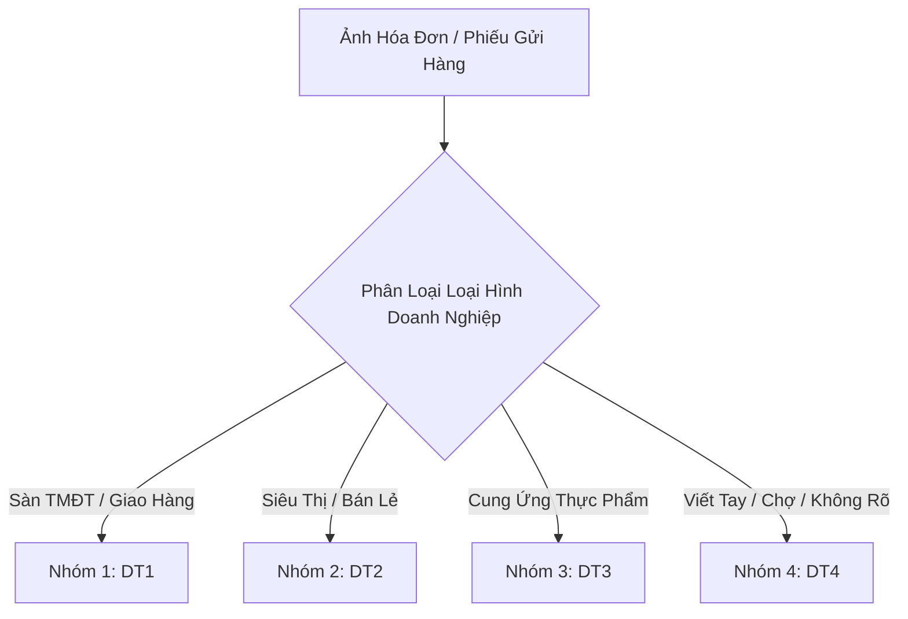
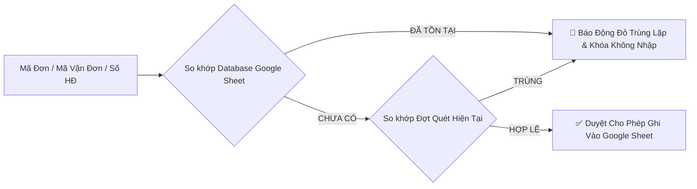

# 📑 BÁO CÁO ĐẶC TẢ QUY TẮC & NGUYÊN TẮC BÓC TÁCH HÓA ĐƠN
**Dự Án:** Hệ Thống Tự Động Hóa Trích Xuất Hóa Đơn Mua Hàng (Procurement Receipt OCR)  
**Phiên Bản Quy Chuẩn:** 2.2 (Cập nhật ngày 15/08/2026)  
**Tình Trạng:** Đã chuẩn hóa & Đồng bộ toàn bộ quy tắc

---

## 1. Cấu Trúc & Nguyên Tắc Cấp Mã Số Giao Dịch (`Mã Đối Tượng`)

Hệ thống tự động cấp phát mã định danh giao dịch tăng dần liên tục cho từng hóa đơn theo công thức chuẩn:

$$\mathbf{DT\{n\}\{XXXX\}}$$

- **`n` (Nhóm đối tượng)**: Thuộc tập số nguyên dương $n \in \{1, 2, 3, 4\}$, tương ứng với 4 nhóm đối tượng doanh nghiệp được quy định ở Phần 2.
- **`XXXX` (Số thứ tự phát sinh)**: Dãy số nguyên dương 4 chữ số tăng dần từ `0001` đến vô cực (`0001`, `0002`, `0003`, ...).

---

### 📌 Nguyên Tắc Cấp Mã Theo Từng Nhóm Đối Tượng:

1. **Đối Với Đối Tượng 1 (Sàn TMĐT & Dịch Vụ Vận Chuyển):**
   - Giữ nguyên tắc mã đối tượng độc bản theo từng đơn hàng: Mỗi đơn hàng/phiếu gửi hàng là 1 giao dịch trọn gói, được cấp một mã đối tượng `DT1XXXX` duy nhất và nhập trên **1 dòng** tổng hợp.
   - Ví dụ: Đơn hàng Shopee thứ 1 được cấp mã `DT10001`, đơn hàng thứ 2 được cấp mã `DT10002`.

2. **Đối Với Các Đối Tượng Khác (Đối Tượng 2, Đối Tượng 3, Đối Tượng 4):**
   - **Quy tắc đồng nhất mã trong cùng hóa đơn:** Các mặt hàng trong cùng một hóa đơn ở các đối tượng này, thì sẽ ghi **cùng mã đối tượng**.
   - **Ví dụ cụ thể:** Mặt hàng A và mặt hàng B cùng nằm trong 1 hóa đơn, thì khi nhập liệu cả mặt hàng A và mặt hàng B đều cùng mã đối tượng.
     + Hóa đơn siêu thị WinMart #1 có 2 món: Sữa chua Vinamilk (Dòng 1: `DT20001`) và Bánh mì sandwich (Dòng 2: `DT20001`).
     + Khi sang hóa đơn siêu thị #2, các mặt hàng sẽ cùng tăng lên mã mới: `DT20002`.

> [!NOTE]
> **Bảng minh họa cấp mã đối tượng:**
> | Hóa Đơn Phát Sinh | Nhóm Đối Tượng | Mặt Hàng Trong Hóa Đơn | Dòng Trên Sheet | Mã Đối Tượng Được Cấp |
> | :---: | :--- | :--- | :---: | :---: |
> | Hóa đơn Shopee #1 | **DT1** (Sàn TMĐT) | Dâu sấy, Nho khô, Chà là | Dòng 1 (Tổng hợp) | **`DT10001`** |
> | Hóa đơn WinMart #1 | **DT2** (Siêu thị) | Sữa chua Vinamilk | Dòng 1 | **`DT20001`** |
> | *(Cùng hóa đơn WinMart #1)* | **DT2** (Siêu thị) | Bánh mì sandwich | Dòng 2 | **`DT20001`** *(Cùng mã)* |
> | Hóa đơn WinMart #2 | **DT2** (Siêu thị) | Nước suối Aquafina | Dòng 3 | **`DT20002`** *(Tăng mã mới)* |
> | Hóa đơn Nông sản #1 | **DT3** (Thực phẩm) | Thịt bò phi lê | Dòng 1 | **`DT30001`** |
> | *(Cùng hóa đơn Nông sản #1)* | **DT3** (Thực phẩm) | Rau cải thìa | Dòng 2 | **`DT30001`** *(Cùng mã)* |
> | Hóa đơn Viết tay #1 | **DT4** (Chợ/Viết tay) | Hành lá, Ớt hiểm | Dòng 1 | **`DT40001`** |

---

## 2. Tiêu Chuẩn Phân Loại 4 Nhóm Đối Tượng Doanh Nghiệp

### Chi Tiết Nhận Diện Từng Nhóm:
1. **Đối Tượng 1 (`DT1`) - Sàn TMĐT & Dịch Vụ Vận Chuyển**:
   - Các đơn vị TMĐT & Logistics: Shopee, SPX Express, Lazada, TikTok Shop, Tiki, GrabExpress, Be, GHTK, GHN, Viettel Post, J&T Express, AhaMove...
   - Đặc điểm: Thường có `Mã đơn hàng` và `Mã vận đơn`, có nhiều mặt hàng gộp chung vào 1 gói cước.

2. **Đối Tượng 2 (`DT2`) - Siêu Thị & Cửa Hàng Tiện Lợi**:
   - Hệ thống bán lẻ: Co.opmart, WinMart / WinMart+, Big C / Tops Market, Go!, Lotte Mart, Aeon Mall, Mega Market, 7-Eleven, Circle K, GS25, Bách Hóa Xanh, Guardian, Con Cưng...
   - Đặc điểm: Hóa đơn dạng cuộn (POS Receipt), liệt kê chi tiết từng mặt hàng và có thể có thuế VAT.

3. **Đối Tượng 3 (`DT3`) - Doanh Nghiệp Cung Ứng Thực Phẩm**:
   - Nhà cung cấp thịt cá, rau củ quả, nông sản tươi sống, nguyên liệu chế biến suất ăn F&B.
   - Đặc điểm: Phiếu giao hàng / hóa đơn thực phẩm thường xuyên có các mặt hàng phụ kèm hoặc mặt hàng cần loại trừ.

4. **Đối Tượng 4 (`DT4`) - Hóa Đơn Viết Tay & Không Rõ Danh Tính**:
   - Giấy viết tay chợ truyền thống, biên nhận bán lẻ không in sẵn mã số thuế hoặc không xác định rõ pháp nhân người mua/người bán.

---

## 3. Quy Chuẩn Trình Bày 10 Cột Trên Google Sheet

Cấu trúc khung chuẩn áp dụng cho bảng tính Google Sheet gồm **10 Cột (A ➜ J)**:

| Cột | Ký Hiệu | Tên Cột Chuẩn | Ý Nghĩa / Mục Đích |
| :---: | :---: | :--- | :--- |
| **A** | Mục 1 | **Mã đối tượng** | Mã định danh tự động tăng dạng `DTnXXXX` |
| **B** | Mục 2 | **Ngày, tháng, năm** | Thời gian phát sinh giao dịch / ngày đặt hàng |
| **C** | Mục 2.1 | **Tên công ty** | Tên cửa hàng, đơn vị bán, sàn TMĐT hoặc dịch vụ vận chuyển |
| **D** | Mục 3 | **Địa chỉ** | Địa chỉ người bán / địa chỉ gửi hàng |
| **E** | Mục 4 | **Mã hóa đơn, chứng từ** | Số hóa đơn, mã đơn hàng hoặc mã chứng từ bảo hành |
| **F** | Mục 5 | **Tên hàng hóa, dịch vụ** | Tên chi tiết của từng mặt hàng |
| **G** | Mục 6 | **Số lượng** | Số lượng mặt hàng / tổng số lượng |
| **H** | Mục 7 | **Đơn giá / Thành tiền** | Đơn giá từng món hoặc tổng giá trị thanh toán |
| **I** | Mục 7.1 | **Người mua/nhận hàng** | Tên người mua hàng / người nhận hàng trên hóa đơn |
| **J** | Mục 8 | **Ghi chú** | Thông tin phụ trợ, mã vận đơn, cảnh báo VAT hoặc danh sách hàng |

---

## 4. Quy Tắc Định Dạng Riêng Biệt Cho Từng Nhóm Đối Tượng

### 4.1. Quy Tắc Đối Tượng 1 (`DT1` - Sàn TMĐT & Vận Chuyển)
> [!IMPORTANT]
> - **Cột A (Mã đối tượng)**: Ghi mã giao dịch tự động tăng **`DT1XXXX`**.
> - **Cột B (Ngày tháng)**: Thời gian đơn hàng được đặt.
> - **Cột C (Tên công ty)**: Tên dịch vụ giao hàng / Tên sàn TMĐT / Tên Shop.
> - **Cột D (Địa chỉ)**: Địa chỉ giao hoặc nhận hàng.
> - **Cột E (Mã chứng từ)**: **Điền Mã đơn hàng** của sàn TMĐT (ví dụ: `2601287Q55X4RX`).
> - **Cột F (Tên hàng hóa)**: **Để trống `""`** (Không nhập tên hàng vào Cột F).
> - **Cột G (Số lượng)**: **Tổng số lượng** tất cả sản phẩm trong đơn hàng.
> - **Cột H (Thành tiền)**: **Tổng số tiền** thanh toán của đơn hàng (Tiền COD / Tổng thanh toán).
> - **Cột I (Người nhận hàng)**: Tên người nhận trên phiếu giao hàng.
> - **Cột J (Ghi chú)**: **Bổ sung Mã vận đơn cùng với Danh sách tên các mặt hàng** (kèm số lượng từng món).

### 4.2. Quy Tắc Đối Tượng 2 (`DT2` - Siêu Thị & Cửa Hàng Bán Lẻ)
- Điền đầy đủ 10 cột theo từng mặt hàng trên hóa đơn (1 mặt hàng = 1 dòng trên Google Sheet).
- **Tất cả các mặt hàng trong cùng 1 hóa đơn ghi cùng mã `DT2XXXX`**.
- Cột I: Điền tên người mua hàng (nếu có).
- **Cảnh báo thuế VAT**: Nếu hóa đơn phát sinh thuế GTGT / VAT $> 0$, hệ thống tự động gắn cờ cảnh báo màu vàng để người dùng rà soát thủ công.

### 4.3. Quy Tắc Đối Tượng 3 (`DT3` - Doanh Nghiệp Cung Ứng Thực Phẩm)
- Điền đầy đủ 10 cột.
- **Tất cả các mặt hàng hợp lệ trong cùng 1 hóa đơn ghi cùng mã `DT3XXXX`**.
- **Quy tắc Lọc Bắt Buộc**: Hệ thống **tự động loại bỏ hoàn toàn các dòng mặt hàng có chứa ký hiệu `"(loại bỏ)"`** trong tên sản phẩm (Không xuất các dòng này sang Google Sheet).
- Cột I: Điền tên người mua/nhận hàng.
- Cảnh báo VAT nếu có.

### 4.4. Quy Tắc Đối Tượng 4 (`DT4` - Giấy Viết Tay & Không Rõ Danh Tính)
- Áp dụng nguyên tắc **"Điền nếu có"**:
  - Mã đối tượng: **Tất cả mặt hàng trong cùng 1 phiếu viết tay ghi cùng mã `DT4XXXX`**.
  - Ngày tháng năm: *(Điền nếu nhận diện được)*
  - Tên công ty / Người bán: *(Điền nếu có)*
  - Địa chỉ: *(Điền nếu có)*
  - Mã hóa đơn / phiếu thu: *(Điền nếu có)*
  - Tên hàng hóa: Trích xuất các món viết tay.
  - Số lượng & Thành tiền: *(Điền nếu có)*
  - Người mua/nhận: *(Điền nếu có)*
  - Ghi chú: Ghi nhận `"Hóa đơn / Giấy viết tay"`.

---

## 5. Cơ Chế Chống Trùng Lặp & Bảo Vệ Dữ Liệu (Duplicate Guard)

1. **Khóa Định Danh Đối Soát**:
   - Bóc tách: `Mã đơn hàng`, `Mã vận đơn`, `Số hóa đơn VAT`, `Mã tra cứu HĐĐT`.
2. **Cơ Chế Khóa An Toàn**:
   - Khi phát hiện trùng lặp với lịch sử hoặc trùng lặp nội bộ đợt quét, hệ thống **tự động bỏ tích chọn (Uncheck)** và hiển thị thông báo đỏ cảnh báo người dùng.
